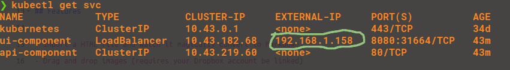
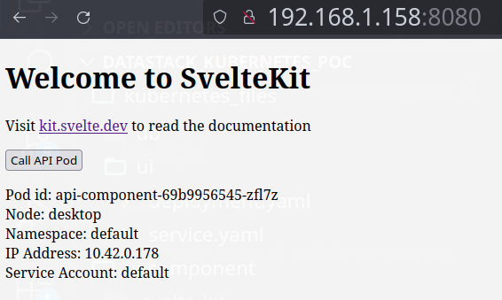
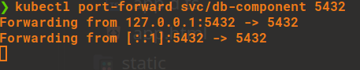
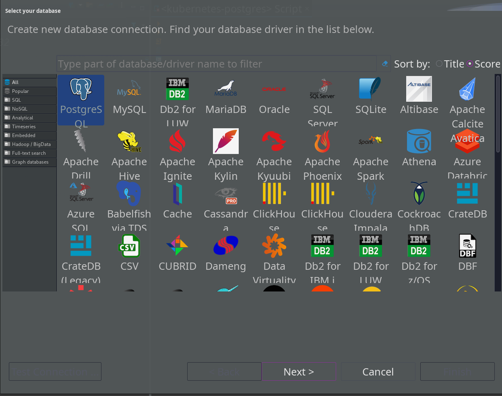
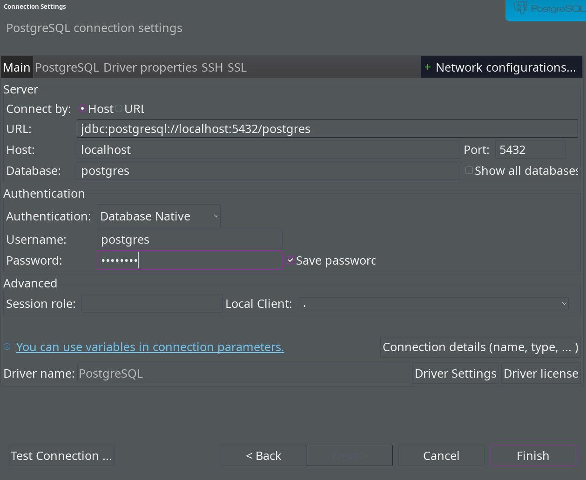
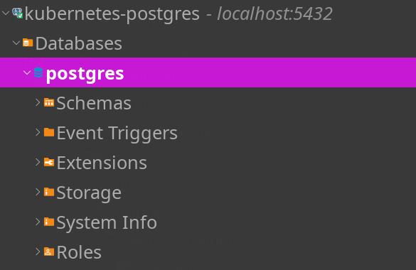
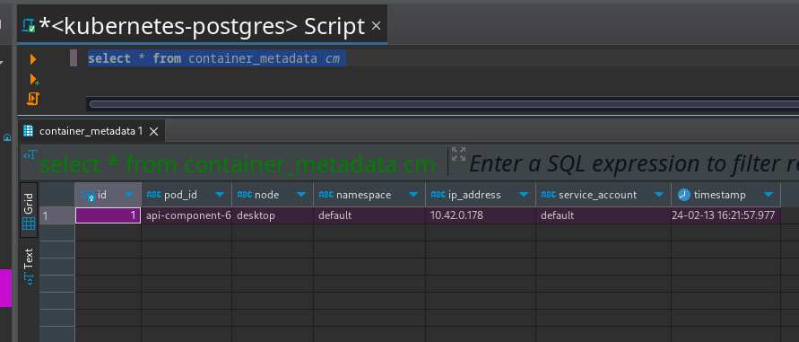

# How to use

Clone this repository
`git clone git@github.com:c-x-g/datastack_kubernetes_poc.git`

### Deploying Kubernetes Components

To run the Kubernetes components locally use these commands:

```
cd datastack_kubernetes_poc/kubernetes_files
kubectl apply -f ui -f api -f db
```

this will deploy pods for the UI, API and a Postgres database

You can view how to access the ui component locally by finding the service ip address
`kubectl get svc`

Look for the ui-component which has an external ip value



Access that url (in my case 192.168.1.158:8080) and you should a simple page with a button,
if you click on that button and it works as expected you will find some metadata about the
api container that is called



### Inspecting the Database

The metadata returned from the webpage is written and stored in the Postgres database

If you would like to view the data in the table, please use a GUI tool (in my case DBeaver)

First run this command:

```
kubectl port-forward svc/db-component 5432
```

this will create an opening between your host machine and the database pod on port 5432 from your host machine (specified in this command) and the existing 5432 port on the Postgres pod (as specified from the db/service.yaml manifest)



**Setting up the Connection**
I will be using DBeaver as the tool to create the connection

First in the top tabs, go to **Database** -> **New Database Connection**

In the popup window, select Postgres and click Next


On the next page all the default values should be correct except for the password that needs to be added


[I have included the password here](https://docs.google.com/document/d/1cxCV4qGHWF6OWBWALdnDCJ9-lRlBLImvCA2Z9ZUCU5c)

Once the password is included, click on Finish and the connection should be successfully created

On the left hand side you should see a new connection that is created, double-click on it to connect to it, expand the connection and the databases section, you should find a database called Postgres, right-click it and select **SQL Editor** -> **Open SQL Script**



A new window in the center should appear where you can write and execute SQL queries,
add this SQL command and press the orange arrow to run it

```
select * from container_metadata cm;
```

if everything works as expected, you should see an entry identical to the response you received from the UI webpage


