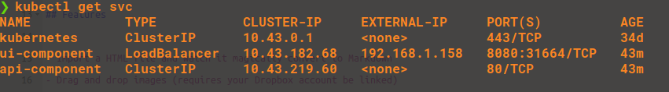
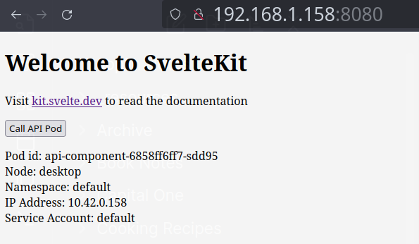

# How to use

Clone this repository
`git clone git@github.com:c-x-g/datastack_kubernetes_poc.git`

To run the Kubernetes components locally use these commands:

```
cd datastack_kubernetes_poc/kubernetes_files
kubectl apply -f ui -f api
```

You can view how to access the ui component locally by finding the service ip address
`kubectl get svc`

Look for the ui-component which has an external ip value



Access that url (in my case 192.168.1.158:8080) and you should a simple page with a button,
if you click on that button and it works as expected you will find some metadata about the
api container that is called


